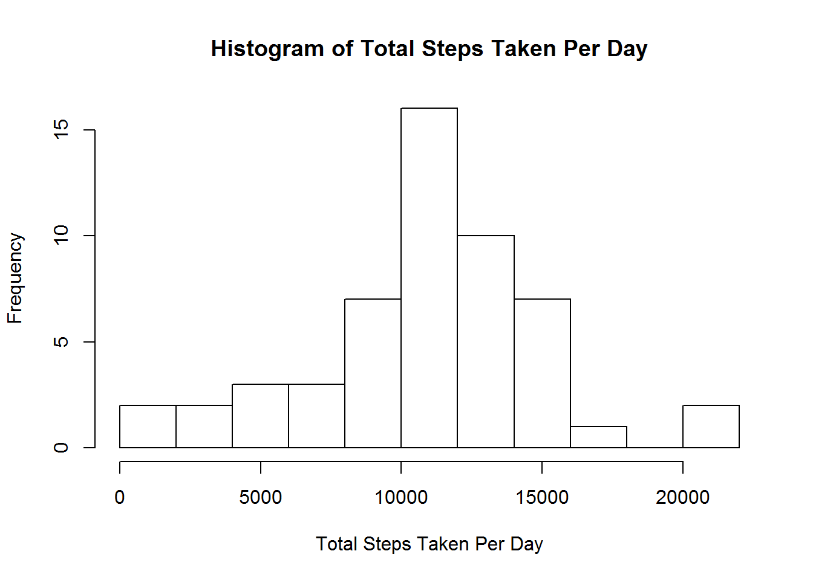
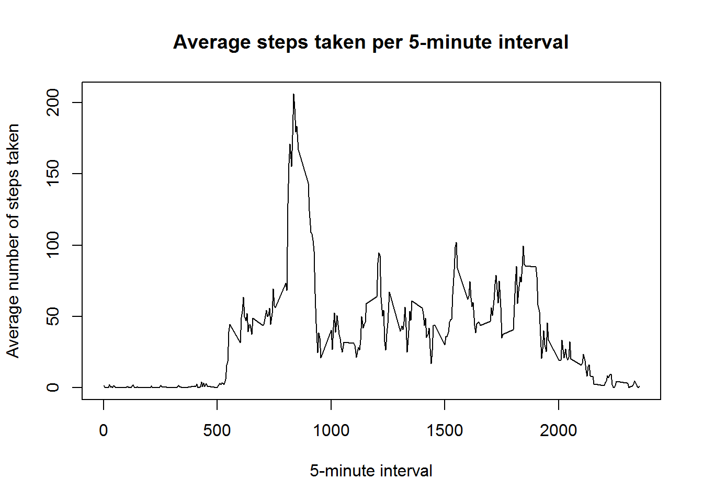
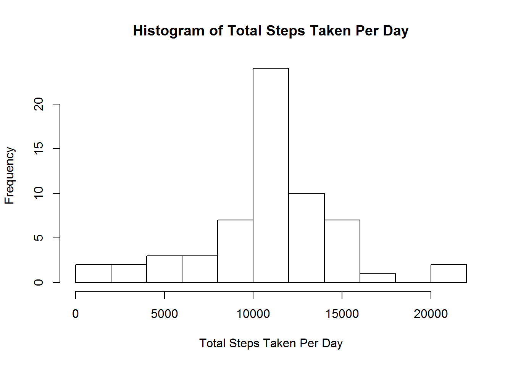
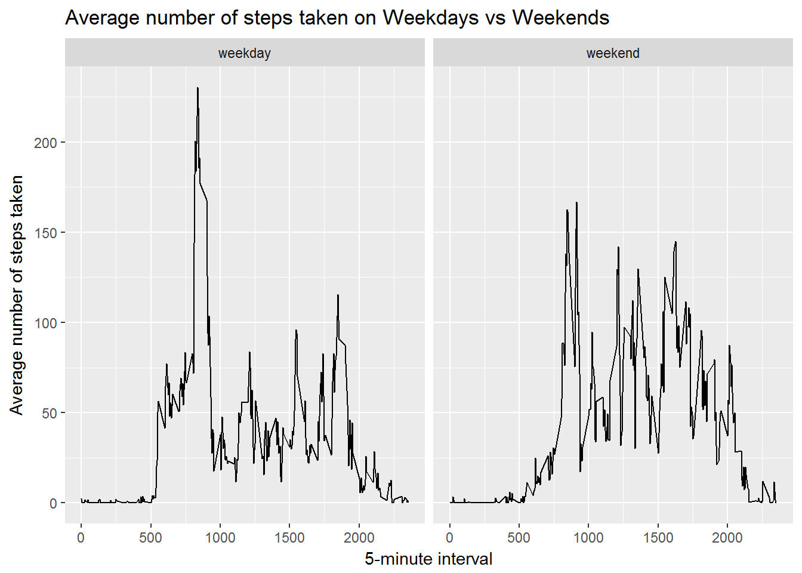

Loading and preprocessing the data
----------------------------------

Load the data and process/transform the data into a format suitable for
your analysis.

    # load the data
    activity <- read.csv("./data/activity.csv", header = TRUE)

    # use head, str and summary functions to get a better understanding of the data
    head(activity)

    ##   steps       date interval
    ## 1    NA 2012-10-01        0
    ## 2    NA 2012-10-01        5
    ## 3    NA 2012-10-01       10
    ## 4    NA 2012-10-01       15
    ## 5    NA 2012-10-01       20
    ## 6    NA 2012-10-01       25

    str(activity)

    ## 'data.frame':    17568 obs. of  3 variables:
    ##  $ steps   : int  NA NA NA NA NA NA NA NA NA NA ...
    ##  $ date    : Factor w/ 61 levels "2012-10-01","2012-10-02",..: 1 1 1 1 1 1 1 1 1 1 ...
    ##  $ interval: int  0 5 10 15 20 25 30 35 40 45 ...

    summary(activity)

    ##      steps                date          interval     
    ##  Min.   :  0.00   2012-10-01:  288   Min.   :   0.0  
    ##  1st Qu.:  0.00   2012-10-02:  288   1st Qu.: 588.8  
    ##  Median :  0.00   2012-10-03:  288   Median :1177.5  
    ##  Mean   : 37.38   2012-10-04:  288   Mean   :1177.5  
    ##  3rd Qu.: 12.00   2012-10-05:  288   3rd Qu.:1766.2  
    ##  Max.   :806.00   2012-10-06:  288   Max.   :2355.0  
    ##  NA's   :2304     (Other)   :15840

    # date column is of type Factor, convert it to date format and check that conversion worked with str function
    activity$date <- as.Date(activity$date, format = "%Y-%m-%d")
    str(activity)

    ## 'data.frame':    17568 obs. of  3 variables:
    ##  $ steps   : int  NA NA NA NA NA NA NA NA NA NA ...
    ##  $ date    : Date, format: "2012-10-01" "2012-10-01" ...
    ##  $ interval: int  0 5 10 15 20 25 30 35 40 45 ...

What is mean total number of steps taken per day?
-------------------------------------------------

For this part of the assignment, you can ignore the missing values in
the dataset.

1.  Calculate the total number of steps taken per day

<!-- -->

    # calculate steps taken per day, ignoring missing values
    activity_nona <- na.omit(activity)
    steps_per_day <- tapply(activity_nona$steps, activity_nona$date, FUN=sum, na.rm=TRUE)
    head(steps_per_day)

    ## 2012-10-02 2012-10-03 2012-10-04 2012-10-05 2012-10-06 2012-10-07 
    ##        126      11352      12116      13294      15420      11015

1.  Make a histogram of the total number of steps taken each day

<!-- -->

    # using base to create histogram
    hist(steps_per_day, xlab = "Total Steps Taken Per Day", ylab = "Frequency", main = "Histogram of Total Steps Taken Per Day", breaks=15)

1.  Calculate and report the mean and median of the total number of
    steps taken per day

<!-- -->

    mean(steps_per_day)

    ## [1] 10766.19

    median(steps_per_day)

    ## [1] 10765

What is the average daily activity pattern?
-------------------------------------------

1.  Make a time series plot of the 5-minute interval and the average
    number of steps taken, averaged across all days

<!-- -->

    library(dplyr)

    ## Warning: package 'dplyr' was built under R version 3.4.3

    ## 
    ## Attaching package: 'dplyr'

    ## The following objects are masked from 'package:stats':
    ## 
    ##     filter, lag

    ## The following objects are masked from 'package:base':
    ## 
    ##     intersect, setdiff, setequal, union

    average_steps <- activity %>% select(interval, steps) %>% na.omit() %>% group_by(interval) %>% summarize(avgsteps= mean(steps)) 
    plot(average_steps$interval, average_steps$avgsteps, xlab="5-minute interval", ylab="Average number of steps taken", main="Average steps taken per 5-minute interval", type="l")

1.  Which 5-minute interval, on average across all the days in the
    dataset, contains the maximum number of steps?

<!-- -->

    average_steps[which.max(average_steps$avgsteps), ]

    ## # A tibble: 1 x 2
    ##   interval avgsteps
    ##      <int>    <dbl>
    ## 1      835 206.1698

Imputing missing values
-----------------------

1.  Calculate and report the total number of missing values in the
    dataset

<!-- -->

    activity_na <- is.na(activity$steps)
    sum(activity_na)

    ## [1] 2304

1.  Devise a strategy for filling in all of the missing values in the
    dataset. The strategy does not need to be sophisticated. For
    example, you could use the mean/median for that day, or the mean for
    that 5-minute interval, etc

<!-- -->

    # Fill in missing values with the mean number of steps for that interval (excluding NAs)
    replace_data <- function(x) {
      replace(x, is.na(x), mean(x, na.rm = TRUE))
    }

1.  Create a new dataset that is equal to the original dataset but with
    the missing data filled in

<!-- -->

    activity_2 <- activity %>% group_by(interval) %>% mutate(steps = replace_data(steps))

    ## Warning: package 'bindrcpp' was built under R version 3.4.3

    head(activity_2)

    ## # A tibble: 6 x 3
    ## # Groups:   interval [6]
    ##       steps       date interval
    ##       <dbl>     <date>    <int>
    ## 1 1.7169811 2012-10-01        0
    ## 2 0.3396226 2012-10-01        5
    ## 3 0.1320755 2012-10-01       10
    ## 4 0.1509434 2012-10-01       15
    ## 5 0.0754717 2012-10-01       20
    ## 6 2.0943396 2012-10-01       25

    # check that there are no NAs left in data
    activity_na_2 <- is.na(activity_2$steps)
    sum(activity_na_2)

    ## [1] 0

1.  Make a histogram of the total number of steps taken each day and
    calculate and report the mean and median total number of steps taken
    per day. Do these values differ from the estimates from the first
    part of the assignment? What is the impact of imputing missing data
    on the estimates of the total daily number of steps?

<!-- -->

    steps_per_day_2 <- tapply(activity_2$steps, activity_2$date, FUN=sum, na.rm=TRUE)
    hist(steps_per_day_2, xlab = "Total Steps Taken Per Day", ylab = "Frequency", main = "Histogram of Total Steps Taken Per Day", breaks=15)

    mean(steps_per_day_2)

    ## [1] 10766.19

    median(steps_per_day_2)

    ## [1] 10766.19

The mean of this new dataset is the same as the mean calculated in the
first part of the assignment because in the original data, the NAs were
removed and were not part of the mean calculation, whereas now we have
added additional rows to the data where the steps are based on the
average of that same dataset, resulting in the exact same mean as
before.

However, the median is now higher because we have added additional rows
using the mean of the original data, pushing up the median to be exactly
the same as the mean in the new dataset.

Are there differences in activity patterns between weekdays and weekends?
-------------------------------------------------------------------------

1.  Create a new factor variable in the dataset with two levels -
    "weekday" and "weekend" indicating whether a given date is a weekday
    or weekend day

<!-- -->

    activity_2$day <- weekdays(activity_2$date)
    activity_2$weekday_or_weekend <- ifelse(activity_2$day %in% c("Saturday", "Sunday"), "weekend", "weekday")

1.  Make a panel plot containing a time series plot of the 5-minute
    interval and the average number of steps taken, averaged across all
    weekday days or weekend days

<!-- -->

    average_steps_2 <- activity_2 %>% select(interval, steps, weekday_or_weekend) %>% group_by(interval, weekday_or_weekend) %>% summarize(avgsteps= mean(steps))

    library(ggplot2)

    ## Warning: package 'ggplot2' was built under R version 3.4.3

    ggplot(average_steps_2, aes(x = interval, y = avgsteps)) + 
        geom_line() +
        facet_grid(.~ weekday_or_weekend) + 
        xlab("5-minute interval") + 
        ylab("Average number of steps taken") +
        ggtitle("Average number of steps taken on Weekdays vs Weekends")

